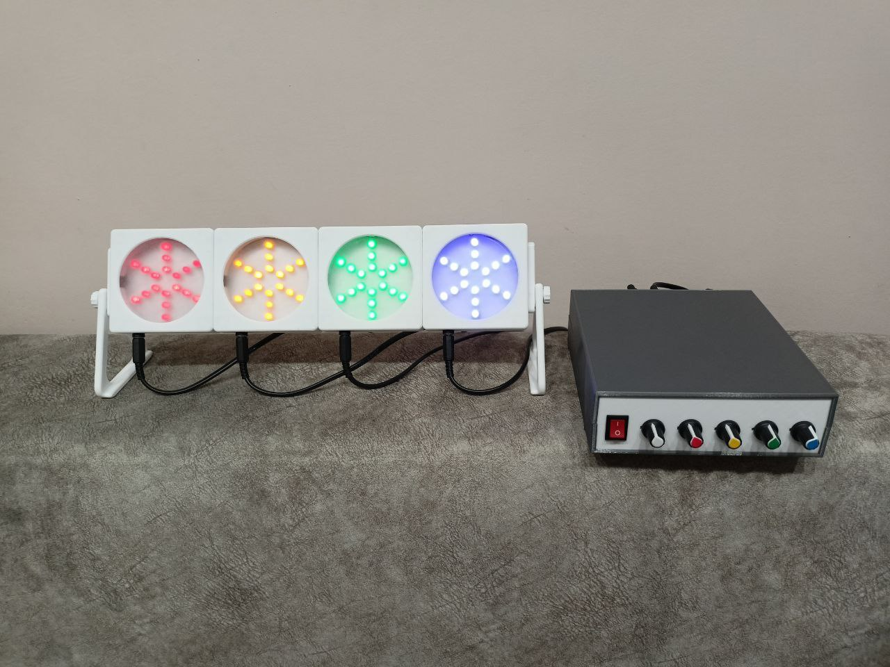
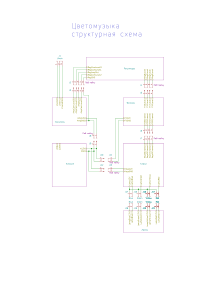

### Название

Цветомузыка

### Цели

- Воплотить давнюю задумку.
- Получить опыт разработки аналоговых устройств (усилитель и расчет фильтров).

### Описание

Устройство служит для светового сопровождения музыкальных произведений. 
Состоит из четырех ламп (синего, зеленого, желтого и красного цветов) и блока управления.
Блок питания можно взять любой с напряжением 12 В и силой тока удовлетворяющей нагрузке.

Диапазон звуковой частоты разделен на четыре интервала:
- до 300 Гц для красной лампы
- 300 - 3000 Гц для желтой лампы
- 3000 - 6000 Гц для зеленой лампы
- от 6000 Гц для синей лампы

Лампы выполнены в виде соединенных последовательно-параллельно светодиодов.

В блоке управления все узлы выполнены на отдельных платах для возможности модификации и внесения изменений.

##### Список узлов (плат):
- регуляторы (переменные резисторы)
- усилитель (на ОУ LM358)
- фильтры (полосовые Баттерворта 1 порядка на ОУ LM358)
- ключи (выполнены на полевых транзисторах)
- плата разводки питания

### Использованное ПО, библиотеки.

Разработка схемы и плат - KiCad 7.0.1

### Внешний вид

### Структурная схема

